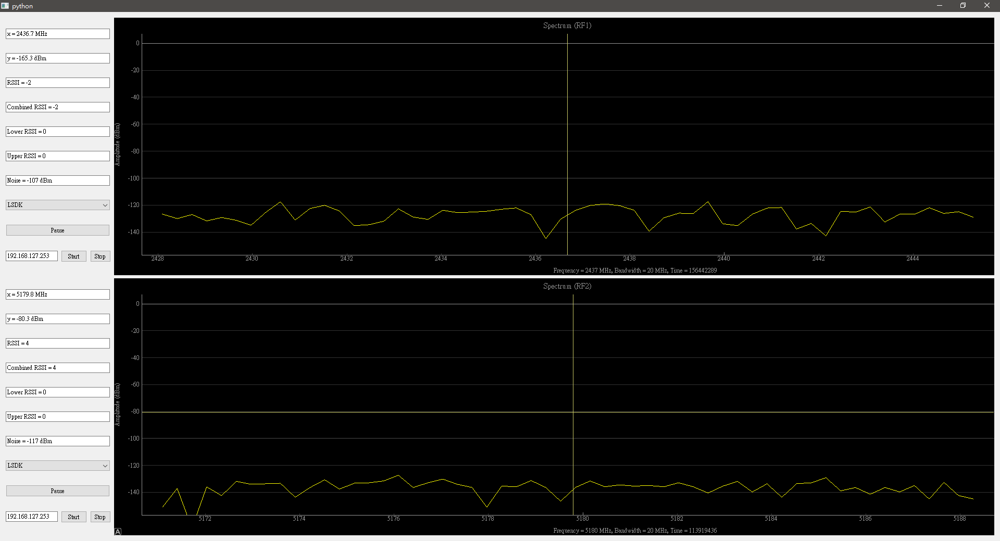
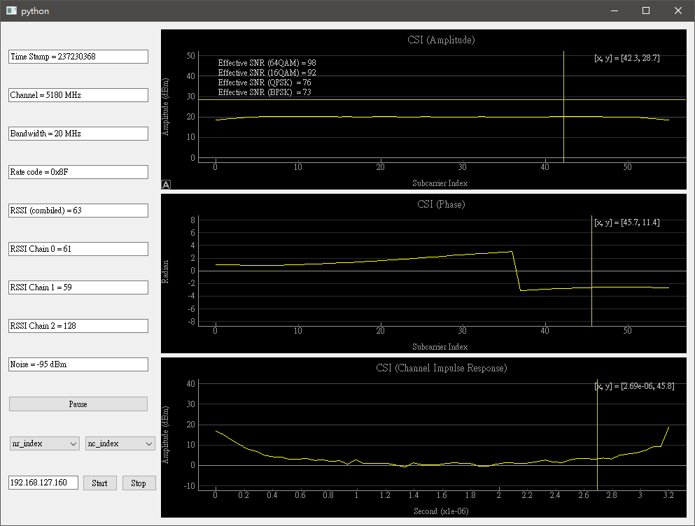

# IW Spectrum & CSI

Draw Spectrum & CSI

## Getting Started
### 1. Clone iw-spectrum project
```
git clone --recurse-submodules ssh://git@gitlab.iw.moxa.com:30/Joey_Peng/iw-spectrum.git
```

### 2. Install python3 and necessary modules
```
sudo apt-get install python3 python3-pip
sudo pip3 install PyQt5 pyqtgraph paramiko scp scipy ptvsd
```

### 3. Execute iw_spectrum and/or iw_csi
```
python3 iw_spectrum.py
```




```
python3 iw_csi.py
```

